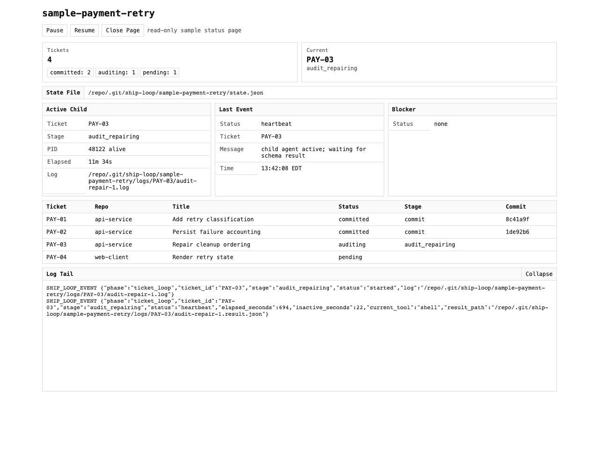

# Ship Loop

Ship Loop is a Codex skill for turning a scoped feature, fix, or improvement into a repo-owned plan, then running a deterministic ticket implementation loop with durable state, per-ticket commits, resume support, final review, and optional PR creation.

The skill is intentionally repo-driven. Product details, plan structure, ticket prompts, and workspace policy live in the target repo or workspace. The skill supplies the orchestration contract and helper scripts.



## Repository Contract

Single-repo mode expects these files at the repo root:

- `agent-prompts/plan-structure.md`
- `agent-prompts/ticket-implementation.md`
- optional `agent-prompts/ship-loop.json`
- optional repo instructions such as `AGENTS.md`

Workspace mode is selected only when the request includes:

```text
Mode: workspace
```

Workspace mode expects `agent-prompts/workspace-mode.md` at the invocation directory. That prompt defines the plan owner repo, prompt root, allowed target repos, worktree path pattern, and documentation boundaries.

## Configuration

Per-repo or per-workspace config lives at `agent-prompts/ship-loop.json`:

```json
{
  "codex_bin": null,
  "model": "gpt-5.5",
  "reasoning_effort": "high",
  "repo_display_suffixes": [],
  "status_open_browser": true
}
```

CLI arguments override this config. Missing fields use public defaults.

Use this file for workspace-specific behavior such as a native Codex binary path, model policy, repo display suffixes, or whether the status page opens automatically.

## Typical Usage

Planning handoff mode uses the full current conversation as the requirements source:

```text
Use $ship-loop to finalize from this conversation.

Kind: feature
```

Direct brief mode is for narrow standalone work:

```text
Use $ship-loop in direct brief mode.

Kind: fix
Brief: Fix malformed role claims so authenticated sessions fail hard at every application boundary.
```

Resume a blocked or interrupted loop with the state path printed by the helper:

```text
Use $ship-loop to resume.

SHIP_LOOP_STATE /absolute/path/to/state.json
```

## What Happens

1. Codex reads the relevant reference files under `references/`.
2. Codex resolves the mode, kind, slug, base branch/commit, repo prompts, and repo instructions.
3. Codex creates an isolated branch and worktree.
4. Codex writes the plan using the repo-owned plan prompt.
5. `scripts/extract_tickets.py` validates ticket structure.
6. Codex commits the plan.
7. `scripts/run_ticket_loop.py` runs ticket implementation, audit/repair, proofs, and ticket commits.
8. `scripts/run_final_review.py` runs final review and optionally publishes PRs with `--publish-if-clean`.

The parent Codex session does not manually implement ticket code after the plan commit. Ticket code changes are owned by child Codex CLI agents launched by the deterministic helper.

## Status UX

The ticket loop normally runs in daemon status-page mode:

```bash
python3 /path/to/skill/scripts/run_ticket_loop.py [plan-path] ... --daemon --serve-status
```

The helper prints:

```text
SHIP_LOOP_STATE /absolute/path/to/state.json
SHIP_LOOP_STATUS_URL http://127.0.0.1:PORT/
SHIP_LOOP_DAEMON_PID 12345
```

The localhost page shows:

- current phase and active ticket;
- ticket counts by status;
- active child PID, elapsed time, log age, current tool, and result path;
- last compact event;
- blocker details when present;
- ticket table with repo, status, stage, and commit;
- recent log tail.

Controls are deliberately narrow:

- **Pause** records a pause request and terminates the active child at a controlled boundary.
- **Resume** launches the persisted deterministic resume command when the run is resumable.
- **Close Page** stops only the inactive/held status server.

The status page must not mutate code, commit, push, create PRs, run final review, or bypass the deterministic helper.

## Runtime State

Run state is stored outside tracked repo contents under the planning repo's git metadata path:

```bash
git -C [planning-repo-worktree] rev-parse --git-path ship-loop/[plan-slug]/state.json
```

Runtime status UI metadata lives under `.ship-loop/[plan-slug]/` in the repo or workspace root and is excluded from tracked repo content when it is inside a Git worktree.

Use summary mode for compact status after blockers or interruptions:

```bash
python3 /path/to/skill/scripts/run_ticket_loop.py --summary --state-file [state-file]
```

## Review And Publishing

Final review is performed by `scripts/run_final_review.py` using the exact base SHAs resolved during worktree creation. Review findings are reported before the run ledger.

Publishing is optional. `gh` is required only when `--publish-if-clean` is used. The helper may push branches and create or reuse PRs, but it must not merge PRs, enable auto-merge, delete branches, or push tags.

## Reference Layout

The detailed behavior contract is split by topic:

- `references/workspace-mode.md`: repo contract, workspace mode, invocation modes, and plan creation.
- `references/ticket-loop.md`: parent boundary, helper scripts, ticket scope, ticket loop, and stop conditions.
- `references/status-server.md`: run state, compact output, daemon mode, status page, pause/resume/close controls.
- `references/resume.md`: state reconciliation and resume rules.
- `references/final-review.md`: final review, publishing, and final reporting.

Read the relevant reference files before running or resuming a loop.
